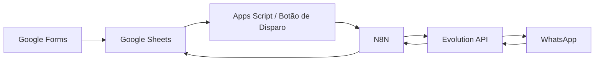

# 🚀 HirePulse

### Plataforma de Alocação de Freelancers Sob Demanda via WhatsApp

> Conectando empresas e trabalhadores em tempo real, com automação inteligente e alta velocidade de resposta.

---

## 📌 Sobre o Produto

O **HirePulse** é uma plataforma de **alocação de freelancers sob demanda**, desenvolvida para conectar empresas a trabalhadores disponíveis de forma rápida, automatizada e escalável.

Utilizando o **WhatsApp como principal canal de comunicação**, o sistema permite distribuir vagas, coletar respostas e organizar contratações em tempo real.

---

## 🧩 Caso de Uso

O HirePulse foi implementado na operação da **BaitaTrampo**, uma empresa que atua na intermediação de freelancers para restaurantes.

Com o sistema, a operação passou a:

* Automatizar o envio de vagas
* Aumentar a velocidade de resposta dos candidatos
* Organizar a base de trabalhadores
* Reduzir esforço manual na alocação

---

## 🎯 Problema

Empresas que trabalham com freelancers e vagas operacionais enfrentam:

* Necessidade de contratação rápida
* Alto volume de candidatos
* Comunicação manual e descentralizada
* Baixa taxa de resposta
* Dificuldade em organizar disponibilidade

---

## 💡 Solução

O HirePulse automatiza todo o processo de alocação:

* 📥 Captação de freelancers via formulário
* 🧠 Organização inteligente da base de dados
* 📲 Distribuição automática de vagas via WhatsApp
* ⚡ Coleta e processamento instantâneo de respostas
* 📊 Atualização em tempo real do status dos candidatos

---

## 🧠 Posicionamento

O HirePulse atua como um:

> **Sistema de alocação e distribuição de freelancers sob demanda**

Diferente de soluções tradicionais de RH, o foco está em:

* Velocidade
* Volume
* Automação
* Resposta imediata

---

## 🧱 Arquitetura

---

## ⚙️ Funcionalidades

### 🔹 Distribuição de Vagas

* Disparo em massa para candidatos elegíveis
* Comunicação direta via WhatsApp
* Mensagens personalizadas

### 🔹 Matching em Tempo Real

* Conexão entre vaga e candidato disponível
* Filtro automático por elegibilidade
* Resposta imediata dos trabalhadores

### 🔹 Processamento de Respostas

* Interpretação automática:

  * `1` → Disponível / Interessado
  * `2` → Não disponível
  * `SAIR` → Opt-out
* Atualização automática no sistema

### 🔹 Gestão Operacional

* Controle de status dos candidatos
* Registro de interações
* Organização centralizada no Google Sheets

---

## 🗂️ Estrutura de Dados

### 📄 CANDIDATOS

| Campo            | Descrição           |
| ---------------- | ------------------- |
| ID_CANDIDATO     | Identificador único |
| NOME             | Nome do freelancer  |
| WHATSAPP         | Contato             |
| DATA_NASCIMENTO  | Validação de idade  |
| ELEGIVEL         | Disponibilidade     |
| STATUS_CANDIDATO | Situação atual      |

---

### 📄 VAGAS

| Campo         | Descrição             |
| ------------- | --------------------- |
| ID_VAGA       | Identificador da vaga |
| RESTAURANTE   | Empresa               |
| FUNCAO        | Função                |
| CIDADE_REGIAO | Local                 |
| DATA_VAGA     | Data                  |
| STATUS_VAGA   | Status                |

---

### 📄 DISPARO_WHATSAPP

| Campo                   | Descrição     |
| ----------------------- | ------------- |
| DATA_DISPARO            | Data do envio |
| ID_CANDIDATO            | Referência    |
| ID_VAGA                 | Referência    |
| STATUS_ENVIO            | Status        |
| RESPOSTA_CANDIDATO      | Retorno       |
| DATA_RESPOSTA_CANDIDATO | Timestamp     |

---

## 🔄 Fluxos Automatizados

### 📤 Distribuição de Vagas

1. Disparo iniciado manualmente no Google Sheets
2. Apps Script aciona o N8N
3. Seleção de candidatos elegíveis
4. Envio automatizado via WhatsApp
5. Registro do envio

---

### 📥 Respostas dos Candidatos

1. Recebimento via webhook
2. Normalização da resposta
3. Classificação automática
4. Atualização na base de dados

---

## 🚀 Operação do Sistema

O HirePulse já está configurado e operacional.

### 1. Entrada de freelancers

* Cadastro via Google Forms
* Dados organizados automaticamente

---

### 2. Cadastro de vagas

* Inserção manual na base
* Sistema identifica candidatos elegíveis

---

### 3. Disparo

* Clique no botão dentro do Google Sheets
* Sistema inicia envio automaticamente

---

### 4. Interação

* Freelancers respondem via WhatsApp
* Sistema interpreta automaticamente

---

### 5. Atualização

* Dados atualizados em tempo real
* Status e respostas registrados

---

## 🧪 Validação

* `1` → Disponível
* `2` → Não disponível
* `SAIR` → Remoção da lista

---

## 🧠 Diferenciais

* Alta velocidade de alocação
* Comunicação direta via WhatsApp
* Automação completa do processo
* Redução de esforço operacional
* Escalabilidade para alto volume

---

## 👤 Autor

Sistema desenvolvido por **Mark (Eduardo)**
Criador do HirePulse

---

## 📄 Licença

Propriedade intelectual do autor. Uso sob autorização.
