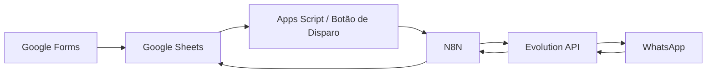

# 🚀 Projeto BaitaTrampo

### Automação de Alocação de Freelancers via WhatsApp

> Projeto desenvolvido durante o bootcamp da GrowDev, com foco em automação de processos e integração de sistemas.

---

## 📌 Sobre o Projeto

Este projeto foi desenvolvido como parte do bootcamp da **GrowDev**, com o objetivo de criar uma solução prática para automatizar o processo de alocação de freelancers em vagas operacionais.

A solução foi construída em parceria com a empresa **BaitaTrampo**, que atua na intermediação de trabalhadores freelancers para restaurantes.

---

## 🎓 Contexto Acadêmico

* 🏫 Bootcamp: GrowDev
* 👨‍🏫 Mentor: Guilherme Pitsch
* 👨‍💻 Desenvolvedor: Mark (Eduardo)
* 🎯 Objetivo: Aplicar conceitos de automação, integração de APIs e lógica de negócios em um cenário real

---

## 🧩 Problema

Durante o levantamento com a empresa, foram identificados os seguintes desafios:

* Alto volume de candidatos
* Processo manual de envio de vagas
* Baixa escalabilidade da operação
* Dificuldade em organizar respostas
* Tempo elevado para preenchimento das vagas

---

## 💡 Solução Desenvolvida

Foi criada uma solução automatizada para:

* 📥 Receber e organizar dados de candidatos
* 📲 Disparar vagas automaticamente via WhatsApp
* ⚡ Processar respostas em tempo real
* 📊 Atualizar o status dos candidatos de forma automática

---

## 🧱 Arquitetura da Solução

---

## ⚙️ Tecnologias Utilizadas

* Google Forms (entrada de dados)
* Google Sheets (base de dados)
* Google Apps Script (automação de disparo)
* N8N (orquestração dos fluxos)
* Evolution API (integração com WhatsApp)
* Docker / Render (infraestrutura)

---

## ⚙️ Funcionalidades

### 🔹 Disparo Automatizado de Vagas

* Envio em massa para candidatos elegíveis
* Mensagens personalizadas via WhatsApp

---

### 🔹 Processamento de Respostas

* Interpretação automática:

  * `1` → Interessado
  * `2` → Não interessado
  * `SAIR` → Opt-out
* Atualização automática no sistema

---

### 🔹 Organização de Dados

* Registro de interações
* Controle de status dos candidatos
* Atualização em tempo real no Google Sheets

---

## 🗂️ Estrutura de Dados

### 📄 CANDIDATOS

| Campo            | Descrição           |
| ---------------- | ------------------- |
| ID_CANDIDATO     | Identificador único |
| NOME             | Nome do freelancer  |
| WHATSAPP         | Contato             |
| DATA_NASCIMENTO  | Validação de idade  |
| ELEGIVEL         | Disponibilidade     |
| STATUS_CANDIDATO | Situação atual      |

---

### 📄 VAGAS

| Campo         | Descrição             |
| ------------- | --------------------- |
| ID_VAGA       | Identificador da vaga |
| RESTAURANTE   | Empresa               |
| FUNCAO        | Função                |
| CIDADE_REGIAO | Local                 |
| DATA_VAGA     | Data                  |
| STATUS_VAGA   | Status                |

---

### 📄 DISPARO_WHATSAPP

| Campo                   | Descrição     |
| ----------------------- | ------------- |
| DATA_DISPARO            | Data do envio |
| ID_CANDIDATO            | Referência    |
| ID_VAGA                 | Referência    |
| STATUS_ENVIO            | Status        |
| RESPOSTA_CANDIDATO      | Retorno       |
| DATA_RESPOSTA_CANDIDATO | Timestamp     |

---

## 🔄 Fluxos Automatizados

### 📤 Disparo de Vagas

1. Acionamento manual via botão no Google Sheets
2. Apps Script envia requisição para o N8N
3. Seleção de candidatos elegíveis
4. Envio automatizado via WhatsApp
5. Registro do envio

---

### 📥 Recebimento de Respostas

1. Captura via webhook
2. Normalização da resposta
3. Classificação automática
4. Atualização na base de dados

---

## 🚀 Funcionamento

### 1. Cadastro de candidatos

* Realizado via Google Forms
* Dados enviados automaticamente para o Sheets

---

### 2. Cadastro de vagas

* Inserção manual na planilha
* Sistema identifica candidatos elegíveis

---

### 3. Disparo

* Realizado através de botão no Google Sheets
* Integração com N8N e WhatsApp

---

### 4. Interação

* Candidatos respondem via WhatsApp
* Sistema processa automaticamente

---

### 5. Atualização

* Dados atualizados em tempo real
* Status registrados automaticamente

---

## 🧪 Testes

* `1` → Interessado
* `2` → Não interessado
* `SAIR` → Remoção da lista

---

## 🧠 Resultados Obtidos

* Redução do processo manual
* Maior agilidade na comunicação
* Melhor organização da base de candidatos
* Maior escalabilidade da operação

---

## 👤 Autor

Projeto desenvolvido por **Mark (Eduardo)**
Durante o bootcamp da GrowDev

---

## 🙌 Agradecimentos

Agradecimento especial ao mentor **Guilherme Pitsch** pelo suporte e orientação durante o desenvolvimento do projeto.

---

## 📄 Licença

Projeto desenvolvido para fins educacionais.
