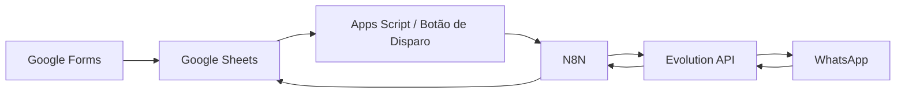

# 🚀 HirePulse

### Plataforma de Automação de Recrutamento via WhatsApp

> Sistema inteligente para conexão rápida entre empresas e candidatos, com automação completa do processo de recrutamento.

---

## 📌 Sobre o Produto

O **HirePulse** é uma plataforma de automação de recrutamento desenvolvida para otimizar a comunicação entre empresas e candidatos, utilizando o **WhatsApp como canal principal**.

A solução elimina processos manuais, acelera contratações e aumenta significativamente a taxa de resposta.

---

## 🧩 Caso de Uso

O sistema foi implementado com sucesso na operação da **BaitaTrampo**, sendo utilizado para:

* Disparo automatizado de vagas
* Gestão de candidatos
* Processamento de respostas em tempo real

---

## 🎯 Problema

Empresas que trabalham com vagas operacionais enfrentam:

* Alto volume de candidatos
* Comunicação manual e lenta
* Baixa taxa de resposta
* Falta de organização dos dados
* Perda de candidatos qualificados

---

## 💡 Solução

O HirePulse automatiza todo o fluxo de recrutamento:

* 📥 Captação de candidatos via formulário
* 🧠 Organização inteligente dos dados
* 📲 Disparo de vagas via WhatsApp
* ⚡ Processamento automático de respostas
* 📊 Atualização em tempo real da base de dados

---

## 🧱 Arquitetura

---

## ⚙️ Funcionalidades

### 🔹 Automação de Recrutamento

* Disparo em massa de vagas
* Personalização de mensagens
* Segmentação de candidatos

### 🔹 Processamento de Respostas

* Interpretação automática:

  * `1` → Interessado
  * `2` → Não interessado
  * `SAIR` → Opt-out
* Normalização e tratamento de dados

### 🔹 Gestão de Dados

* Atualização automática no Google Sheets
* Registro de data e hora das interações
* Controle de status por candidato

### 🔹 Conformidade e Controle

* Consentimento LGPD
* Opt-out automatizado
* Controle de blacklist

---

## 🗂️ Estrutura de Dados

### 📄 CANDIDATOS

| Campo            | Descrição               |
| ---------------- | ----------------------- |
| ID_CANDIDATO     | Identificador único     |
| NOME             | Nome do candidato       |
| WHATSAPP         | Número de contato       |
| DATA_NASCIMENTO  | Validação de idade      |
| ELEGIVEL         | Status de elegibilidade |
| STATUS_CANDIDATO | Situação atual          |

---

### 📄 VAGAS

| Campo         | Descrição             |
| ------------- | --------------------- |
| ID_VAGA       | Identificador da vaga |
| RESTAURANTE   | Empresa               |
| FUNCAO        | Cargo                 |
| CIDADE_REGIAO | Local                 |
| DATA_VAGA     | Data do trabalho      |
| STATUS_VAGA   | Status da vaga        |

---

### 📄 DISPARO_WHATSAPP

| Campo                   | Descrição               |
| ----------------------- | ----------------------- |
| DATA_DISPARO            | Data do envio           |
| ID_CANDIDATO            | Referência do candidato |
| ID_VAGA                 | Referência da vaga      |
| STATUS_ENVIO            | Status do envio         |
| RESPOSTA_CANDIDATO      | Resposta recebida       |
| DATA_RESPOSTA_CANDIDATO | Timestamp da resposta   |

---

## 🔄 Fluxos Automatizados

### 📤 Disparo de Vagas

1. Ação iniciada manualmente pelo Google Sheets
2. Apps Script envia requisição para o N8N
3. N8N seleciona candidatos elegíveis
4. Mensagem é montada automaticamente
5. Envio realizado via Evolution API
6. Status atualizado na planilha

---

### 📥 Recebimento de Respostas

1. Webhook recebe resposta do WhatsApp
2. N8N normaliza a resposta
3. Classificação automática (INTERESSADO / NÃO / SAIR)
4. Atualização na planilha com data e hora

---

## 🚀 Acionamento do Disparo

O envio das vagas é iniciado manualmente por meio de um **botão dentro do Google Sheets**.

Esse botão executa uma função em **Google Apps Script**, responsável por enviar uma requisição HTTP para o webhook do **N8N**, iniciando todo o fluxo automatizado.

Esse modelo garante maior controle operacional sobre o momento do disparo.

---

## 🔗 Integrações

| Serviço            | Função                  |
| ------------------ | ----------------------- |
| Google Forms       | Entrada de candidatos   |
| Google Sheets      | Base de dados           |
| Google Apps Script | Disparo manual          |
| N8N                | Automação dos fluxos    |
| Evolution API      | Integração com WhatsApp |
| Render / Heroku    | Infraestrutura          |

---

## 🛠️ Stack Tecnológica

* N8N (automação)
* Evolution API (WhatsApp)
* Google Sheets & Forms
* Google Apps Script
* Node.js (webhooks)
* Docker + Render

---

## ⚙️ Operação do Sistema

O HirePulse já está configurado e operacional.

O fluxo de utilização ocorre da seguinte forma:

### 1. Alimentação da base

* Candidatos são cadastrados via Google Forms
* Dados são organizados automaticamente no Google Sheets

---

### 2. Preparação das vagas

* As vagas são cadastradas na aba correspondente
* O sistema identifica candidatos elegíveis automaticamente

---

### 3. Disparo das vagas

* O operador acessa o Google Sheets
* Clica no botão de disparo
* O sistema inicia automaticamente o envio via WhatsApp

---

### 4. Interação com candidatos

* Os candidatos respondem diretamente no WhatsApp
* O sistema interpreta automaticamente as respostas

---

### 5. Atualização dos dados

* As respostas são registradas em tempo real
* Status e data/hora são atualizados automaticamente

---

## 🧪 Validação de Funcionamento

Para testar o sistema:

* `1` → candidato interessado
* `2` → candidato não interessado
* `SAIR` → opt-out automático

As informações são refletidas automaticamente na base de dados.

---

## 🧠 Diferenciais

* Comunicação direta via WhatsApp
* Automação completa do funil
* Redução de esforço operacional
* Alta escalabilidade
* Controle manual estratégico do disparo

---

## 👤 Autor

Sistema desenvolvido por **Mark (Eduardo)**
Criador do HirePulse

---

## 📄 Licença

Propriedade intelectual do autor. Uso sob autorização.
